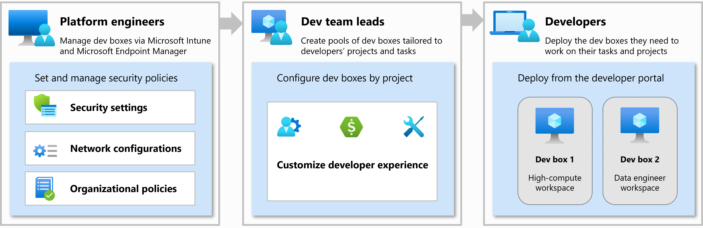

# ステップ2：開発環境の整備（所要時間：約5分）

## 目的
- Azure DevBoxを使って開発環境を整備する

https://learn.microsoft.com/ja-jp/azure/dev-box/overview-what-is-microsoft-dev-box

## Azure DevBoxについて

Azure Dev Boxは、開発者が必要なツールやリソースをすぐに利用できるようにするための、Microsoft Azure上の仮想マシン（VM）です。これにより、開発者は自分のPCに依存せず、どこからでも開発環境を利用できます。Dev Boxは、IT管理者が事前に設定した環境を基にしており、開発者は必要なときに簡単に起動・停止できます。

### 特徴
- **簡単なセットアップ**：IT管理者が事前に設定した環境を基に、開発者は数クリックでDev Boxを作成できます。
- **カスタマイズ可能**：開発者は自分のニーズに合わせてDev Boxをカスタマイズできます。
- **セキュリティ**：Azure上で動作するため、セキュリティが強化されています。
- **スケーラビリティ**：必要に応じてリソースを追加・削除できます。
- **コスト効率**：使用した分だけ課金されるため、無駄なコストがかかりません。

### 利用シナリオ
- **リモート開発**：自宅や外出先からでも、同じ開発環境を利用できます。
- **チーム開発**：チームメンバー全員が同じ環境で作業できるため、環境の違いによる問題が減ります。
- **テスト環境**：本番環境に影響を与えずに、新しい機能や変更をテストできます。
- **教育・トレーニング**：新しい技術やツールを学ぶための環境を簡単に作成できます。

### DevBoxの構成要素
- **Dev Box プール**：複数の Dev Box をまとめて管理するためのグループ。
- **Dev Box 定義**：Dev Box の OS イメージや VM サイズ、インストールするソフトウェアなどの設定を定義します。
- **デベロッパーセンター**：Dev Box を管理するためのポータルです。IT 管理者が Dev Box プールや定義を作成・管理します。
- **プロジェクト**：特定の開発プロジェクトに関連する Dev Box をまとめて管理します。
- **ユーザー**：Dev Box を利用する開発者のアカウントです。Entra ID（旧 Azure AD）を使用します。
- **ネットワーク接続**：Dev Box が接続するネットワークの設定です。Microsoft ホストネットワークまたはカスタム VNet を選択できます。

Dev Box サービスは、組織内の 3 つのロール (プラットフォーム エンジニア、開発チーム リーダー、開発者) を想定して設計されています。
**プラットフォーム エンジニア**と IT 管理者は、協力して、開発者向けのインフラストラクチャとツールを開発者チームに提供します。 プラットフォーム エンジニアは、開発ボックスからリソースへのアクセスのセキュリティを確保するために、セキュリティ設定、ネットワーク構成、組織ポリシーの設定と管理を行います。

**開発者チーム リーダー**は、プロジェクトに関する深い知識を持つ経験豊富な開発者です。 **DevCenter プロジェクト管理ロール**を割り当てることができます。そうすれば、開発者エクスペリエンスの作成と管理を支援できます。 プロジェクト管理者は、開発ボックスのプールを作成および管理します。

開発チームのメンバーである**開発者**には、**DevCenter Dev Box ユーザー ロール**が割り当てられます。 その後、彼らはプロジェクトに対して有効になっている開発ボックス プールから、必要に応じて 1 つまたは複数の開発ボックスをセルフサービスで利用できます。 開発ボックス ユーザーは、複数の開発ボックスを作成すれば、複数のプロジェクトまたはタスクで作業を行うことができます。

  

### 参考リンク
- [Azure Dev Box の概要](https://learn.microsoft.com/ja-jp/azure/dev-box/overview-what-is-microsoft-dev-box)
- [Azure Dev Box のセットアップ](https://learn.microsoft.com/ja-jp/azure/dev-box/dev-box-setup)
- [Azure Dev Box の管理](https://learn.microsoft.com/ja-jp/azure/dev-box/dev-box-admin-guide)
- [Azure Dev Box の開発者ガイド](https://learn.microsoft.com/ja-jp/azure/dev-box/dev-box-developer-guide)
- [Azure Dev Box のトラブルシューティング](https://learn.microsoft.com/ja-jp/azure/dev-box/dev-box-troubleshoot)

## 前提条件
- Azure Dev Box の利用が可能な Azure サブスクリプションを持っていること
- Azure Dev Box の利用が可能な Microsoft 365 ライセンスを持っていること（例：Microsoft 365 E3/E5 または Business Premium ライセンス）
- Intuneが有効化されていること
- IT管理者用ユーザーにContributorのロールが割り当てられていること（今回のシナリオではプロジェクト管理社を省略します）
- 開発者用ユーザーにAzure Dev Box の開発者ロール（DevCenter Dev Box User）が割り当てられていること

## 手順

### ステップ 2-1：Azure DevBoxで開発端末を用意

以下の流れで Azure Dev Box を構成します。
1. Dev Box の初期構成（IT管理者が実施）
    1. デベロッパーセンターの作成
    2. Dev Box 定義の作成
    3. ネットワーク接続の設定
    4. Dev Box プールの作成
    5. プロジェクトの作成とユーザーの割り当て
2. 開発者による Dev Box の作成

#### フェーズ1：管理者による初期構成（初回のみ）

このフェーズは、IT管理者やプラットフォームエンジニアが実施します。

1. 「デベロッパーセンター」の作成
   - Azure Dev Box を利用するためには、まず「デベロッパーセンター」を作成する必要があります
   - デベロッパーセンターは、Dev Box の管理や設定を行うためのポータルです
   1. Azure ポータルで「Dev Box」サービスを検索し、「構成」→「デベロッパーセンター」とたどります
   2. 「デベロッパーセンター」を新規作成します
      - 以下を有効化し、その他は既定のまま
        - 既定の開発ボックス定義を作成する (推奨)
        - クイック スタート カタログを添付する (推奨)

2. 「プロジェクト」の作成
   - プロジェクトは、特定の開発プロジェクトに関連する Dev Box をまとめて管理するためのものです
   - 開発者は、プロジェクトに関連付けられた Dev Box を利用します

   1. 先のステップで作成したデベロッパーセンターにアクセスし、「プロジェクト」を選択します
   2. 「新規作成」をクリックし、以下を入力します
       - 基本情報
         - リソースグループ：リソースグループを選択します（例：DevOpsDemoRG）
         - デベロッパーセンター：先に作成したデベロッパーセンターを選択します 
         - 名前：プロジェクトの名前を入力します（例：DevOps Demo Project）
         - 説明：プロジェクトの説明を入力します（例：DevOpsデモ用プロジェクト）
       - 開発ボックスの管理
         - 開発ボックスの制限を有効にする：開発者あたりのDevBox数の制限を有効にするかどうかを選択します（例：有効）
         - 開発ボックスの制限数：開発者あたりのDevBox数の制限を入力します（例：1）
       - カタログ
         - デプロイ環境の定義：チェックを有効
         - イメージ定義：チェックを有効
          
3. 「Dev Box 定義」の作成
    - Dev Box 定義は、Dev Box の OS イメージや VM サイズ、インストールするソフトウェアなどの設定を定義します
    - 開発者は、ここで用意された Dev Box 定義を選択して Dev Box を作成することになります

   1. 先のステップで作成したデベロッパーセンターにアクセスし、「Dev Box 定義」を選択します
   2. 「新規作成」をクリックし、以下を入力します
      - 名前：Dev Box 定義の名前を入力します
      - 画像（OS イメージ）：使用する OS イメージを選択します（例：Windows 11 + Visual Studio + M365 Apps）
      - イメージのバージョン：使用する OS イメージのバージョンを選択します（例：最新）
      - コンピューティングVM サイズ：使用する VM サイズを選択します（ 8vCPU 32GB RAM | 16vCPU 64GB RAM | 32vCPU 128GB RAM）
      - ストレージサイズ：使用するストレージサイズを選択します（ 256GB | 512GB | 1024GB | 2048GB ）
      - 休止状態を有効にする：休止状態を有効にするかどうかを選択します（例：有効）

4. 「ネットワーク接続」の作成
   - ネットワーク接続は、Dev Box がどのネットワークに接続接続するのか、を指定する設定です
   - ここでネットワーク接続を作成することで、Dev Box プールの説っていで特定の VNet を選択できるようになります
   - 今回のデモ用に予め仮想ネットワーク（VNet）を作成しておきます

   1. DevBoxサービスから「ネットワーク接続」を選択します
   2. 「新規作成」をクリックし、以下を入力します
      - 基本情報
        - ドメイン参加の種類：オンプレミスのADドメインに参加するか否かを選択します（今回はAzure ADを選択。ハイブリッドを選択するとオンプレ AD ドメイン参加となり、追加設定項目入力が必要）
        - 名前：ネットワーク接続の名前を入力します（例：nwcon-devops）
        - 仮想ネットワーク：使用する VNet を選択します（例：vnet-devops）
        - サブネット：使用する VNet サブネットを選択します（例：debops）
   3. で作成したデベロッパーセンターに戦死し、「ネットワーク」を選択します
      - 「追加」を選択肢、作成したネットワーク接続を選択します

5. 「Dev Box プール」の作成
   - Dev Box プールは、DevBox定義やネットワーク接続などの同じ構成を持つDeｖBoxをまとめて管理するためのグループです
   - 開発者は、Dev Box プールから Dev Box を作成します

   1. 2.で作成した「プロジェクト」に遷移し、「開発ボックスプール」を選択します
   2. 「新規作成」をクリックし、以下を入力します
      - 名前：Dev Box プールの名前を入力します（例：DevOps Demo Pool）
      -  定義：3．で作成した Dev Box 定義を選択します
      -  ネットワーク接続：4．で作成したネットワーク接続を選択します
      -  [シングルサインオンを有効にする](https://learn.microsoft.com/ja-jp/azure/dev-box/how-to-enable-single-sign-on#understand-the-sso-user-experience)：チェックを外しておきます（再接続時に認証を求められなくなります）
      -  Dev Box 作成者特権：作成したユーザーにローカルの管理者特権を付与するのか、標準ユーザーとするのか、を選択します
      -  スケジュールに従った自動停止を有効にする：チェックしておきます（自動停止を有効にすると、Dev Box は指定時刻に自動で停止します）
      -  切断時に休止状態を有効にする：チェックしておきます（切断後、指定した猶予時間経過後に休止状態になります。次回接続時にすぐに利用できるようになります）
      -  ライセンス：ライセンスがあることを確認しチェックしておきます（※ Microsoft 365 E3/E5 または Business Premium ライセンスが必要です。）
       
#### フェーズ2：開発者による Dev Box の作成
このフェーズは、開発者自身が実施します。

1. Microsoft Dev Box 開発者ポータル にアクセスする
2. Entra ID（旧 Azure AD）アカウントでサインインする
3. 「新しい Dev Box を作成」をクリックする
   - 以下を入力・選択する
      - 名前：任意の名前
      - プロジェクト名：複数プロジェクトがある場合は選択
      - Dev Box プール（VM サイズやイメージが定義済み）：Dev Box プールを選択する（例：DevOps Demo Pool）
4. 「作成」をクリックし、数分で Dev Box が起動する
5. 起動後、「接続」ボタンからブラウザ経由で RDP 接続する

