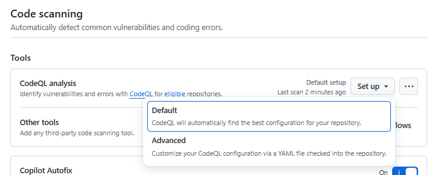

# ステップ4：GitHub Advanced Securityによるセキュリティチェック

## 目的
- コードの品質とセキュリティを自動でチェック
- シークレットや脆弱性の早期発見

## 手順

### ステップ 4-1：GitHub Advanced Security を有効化

1. GitHubリポジトリのトップページを開く
2. 「Settings」→「Security」→「Advanced Security」へ移動
3. 以下の項目を有効化：
- Dependabot / Dependabot alerts
- Code Scanning / CodeQL analysis → setup から 全てデフォルトで「Enable」
- Secret Protection

💡 注意：GHASはGitHub Enterprise Cloudプランで利用可能です。パブリックリポジトリでは一部機能が無料で使えます。

### ステップ 4-2：Code Scanning の設定

#### 設定手順

1. 「Settings」→「Security」→「Advanced Security」へ移動
2. Code Scanning / CodeQL analysis にて、「Setup」をクリック
   1. 「Default」または「Advanced」を選択可能だが、ここでは「Default」を選択
      
３．全てデフォルト値で「Enable」を選択

#### 検証手順

1. ./backend/index.js に以下のコードを追加

    ```javascript
    const userInput = location.hash;
    eval(userInput); // CodeQL によって "使用してはいけない関数" として検出される
    ```
2. commitしてPush
3. スキャンはGitHub Actionsで実行されるため「Actions」タブを開いて「CodeQL」から途中経過・結果を確認
4. スキャン結果は「Security」→「Code scanning alerts」で確認可能

### ステップ 4-3：Secret Scanning の確認

#### 設定手順
- GitHubはPushされたコード内にAPIキーやパスワードなどのシークレットが含まれていないかを自動検出
- 検出された場合、**Securityタブの「Secret scanning alerts」**に表示される
- 対処方法としては、以下のような手順が考えられる
  - 該当シークレットを無効化
  - .envなどに分離し、.gitignoreで除外
  
1. 「Settings」→「Security」→「Advanced Security」へ移動
2. Secret Protection にて、「Enable」をクリック

#### 検証手順

1. シークレットを含むファイルを追加
2. commitしてPush
3. 「Security」→「Secret scanning alerts」で検出結果を確認

### ステップ 4-4：Dependabot による依存関係の脆弱性チェック

#### 設定手順
- Dependabotは、依存関係の脆弱性を自動でチェックし、PRを作成してくれるツール 
- PRをマージすることで安全なバージョンに更新可能

1. 「Settings」→「Security」→「Advanced Security」へ移動
2. Dependabot / Dependabot alerts にて、「Enable」をクリック
3. Dependabot security updates を「Enable」に設定
4. Dependabot version updates を「Enable」に設定
   1. Dependabot の設定ファイル`.github/dependabot.yml` の編集画面が自動的に開く
   - package-ecosystem: npm に編集してCommit

#### 検証手順
1. ./backend/package.json に以下のような脆弱性のあるライブラリを追加

   ```json
   "dependencies": {
      "lodash": "4.17.15" 
   }
   ```
2. backend/package-lock.json を更新
   ```bash
   cd backend/
   npm install
   ```
3. commitしてPush
4. 「Security」→「Dependabot alerts」で検出結果を確認


### 補足Tips
- PR作成時に自動スキャンを走らせることで、レビュー前に問題を検出可能
- SlackやTeamsと連携してアラート通知も可能
- GitHub Actionsと組み合わせてCI/CDに統合するのがベストプラクティス

1. Code Scanningのカスタムルール
   - CodeQLはカスタムクエリを作成可能です。
   - 独自のセキュリティポリシーやコーディング規約に基づいたチェックを追加できます。
   - 例：特定のライブラリの使用禁止、ログ出力の形式チェックなど。

2. Secret Scanningの拡張
   - GitHubは主要なクラウドプロバイダー（AWS, Azure, GCPなど）のシークレットパターンを自動検出します。
   - カスタムパターンも設定可能（例：社内APIキーの形式など）。
   - Enterpriseプランでは**プッシュ前スキャン（Push Protection）**も利用可能。
   - 
3. セキュリティアラートの自動通知
   - GitHub ActionsやWebhookを使って、SlackやTeamsにアラートを通知可能。
   - 例：security-events パーミッションを使って、アラートをJSON形式で取得し、通知に活用。

4. セキュリティダッシュボードの活用
   - Organizationレベルでのセキュリティダッシュボードを使えば、複数リポジトリの状態を一元管理可能。
   - 脆弱性の傾向や未対応のアラートを可視化できます。
   - 
5. CI/CDとの統合
   - Code ScanningやSecret Scanningは、GitHub Actionsのワークフローに組み込むことで、PR作成時に自動チェックが可能。
   - セキュリティチェックを**ブロッカー（必須チェック）**として設定することで、問題のあるコードのマージを防止できます。
     - 実践例：PR時にセキュリティチェックを必須にする
       - リポジトリの「Settings」→「Branches」→「Branch protection rules」を開く
       - mainブランチに対して以下を設定：
         - Require status checks to pass before merging
         - Include CodeQL や Secret Scanning のチェック名を指定
  
### 参考リンク（公式ドキュメント）
- [GitHub Advanced Security Overview](https://docs.github.com/ja/get-started/learning-about-github/about-github-advanced-security)
- [CodeQL Custom Queries](https://docs.github.com/ja/code-security/codeql-cli/using-the-advanced-functionality-of-the-codeql-cli/using-custom-queries-with-the-codeql-cli)
- [Secret Scanning Patterns](https://docs.github.com/ja/code-security/secret-scanning/introduction/supported-secret-scanning-patterns)
- [Dependabot Configuration](https://docs.github.com/ja/code-security/supply-chain-security/keeping-your-dependencies-updated-automatically/configuration-options-for-dependency-updates)